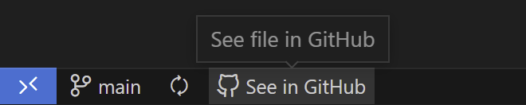

  

  <h1>See file in GitHub</h1>
  VS Code extension for opening files on GitHub through a button in the status bar.
   
   
  

Built on top of [VS Code Open in GitHub Button](https://github.com/antfu/vscode-open-in-github-button).

<!-- ## To do

- [ ] Add tests
- [ ] Add support for other git providers (GitLab, BitBucket, etc) -->

## Support

If you like this project, please consider supporting it through a [PayPal donation](https://paypal.me/marsigliacr). :blush:

## License

[MIT](./LICENSE) License © 2022 [Luis Marsiglia](https://github.com/marsidev)
